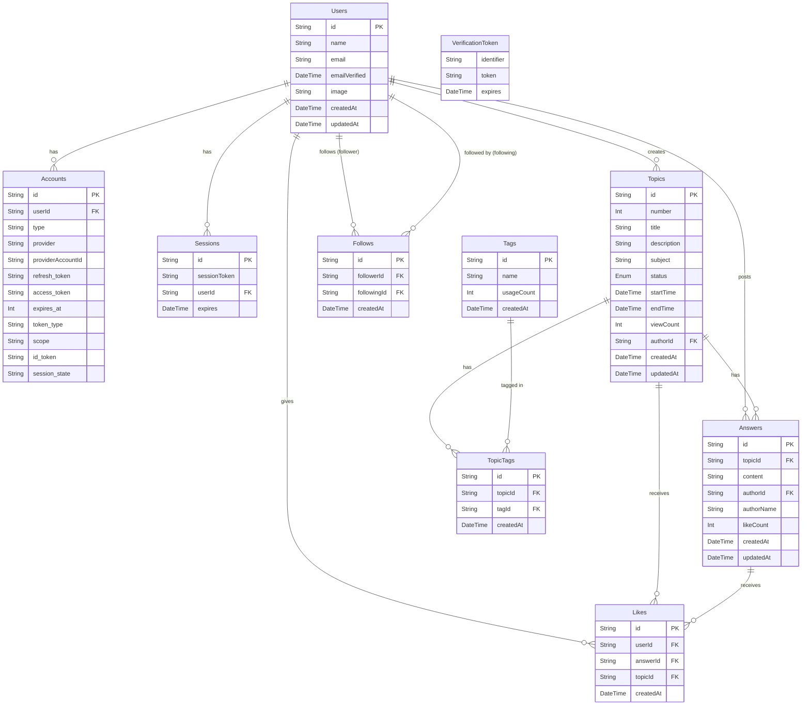

# ER図 - 大喜利Q&Aプラットフォーム

## 概要
このドキュメントでは、匿名Q&A（大喜利）プラットフォームのデータベース設計を定義します。

---

## エンティティ一覧

### 1. Users（ユーザー）
ユーザーアカウント情報を管理します。NextAuth.jsの仕様に準拠。

| カラム名 | データ型 | 制約 | 説明 |
|---------|---------|------|------|
| id | String | PK, UUID | ユーザーID |
| name | String | Nullable | 表示名 |
| email | String | Unique, Nullable | メールアドレス |
| emailVerified | DateTime | Nullable | メール認証日時 |
| image | String | Nullable | プロフィール画像URL |
| createdAt | DateTime | Default: now() | アカウント作成日時 |
| updatedAt | DateTime | Auto-update | 更新日時 |

**リレーション:**
- 1:N → Accounts
- 1:N → Sessions
- 1:N → Topics（作成したトピック）
- 1:N → Answers（投稿した回答）
- 1:N → Likes（付与したいいね）
- 1:N → Follows（フォローしている関係）
- 1:N → Follows（フォローされている関係）

---

### 2. Accounts（アカウント連携）
OAuth プロバイダー情報を管理します。NextAuth.jsの仕様に準拠。

| カラム名 | データ型 | 制約 | 説明 |
|---------|---------|------|------|
| id | String | PK, UUID | アカウントID |
| userId | String | FK → Users.id | ユーザーID |
| type | String | Required | アカウントタイプ（oauth等） |
| provider | String | Required | プロバイダー名（google, github等） |
| providerAccountId | String | Required | プロバイダー側のアカウントID |
| refresh_token | String | Nullable | リフレッシュトークン |
| access_token | String | Nullable | アクセストークン |
| expires_at | Int | Nullable | トークン有効期限 |
| token_type | String | Nullable | トークンタイプ |
| scope | String | Nullable | スコープ |
| id_token | String | Nullable | IDトークン |
| session_state | String | Nullable | セッション状態 |

**インデックス:**
- Unique: (provider, providerAccountId)

**リレーション:**
- N:1 → Users

---

### 3. Sessions（セッション）
ユーザーセッション情報を管理します。

| カラム名 | データ型 | 制約 | 説明 |
|---------|---------|------|------|
| id | String | PK, UUID | セッションID |
| sessionToken | String | Unique | セッショントークン |
| userId | String | FK → Users.id | ユーザーID |
| expires | DateTime | Required | セッション有効期限 |

**リレーション:**
- N:1 → Users

---

### 4. VerificationToken（認証トークン）
メール認証用のトークンを管理します。

| カラム名 | データ型 | 制約 | 説明 |
|---------|---------|------|------|
| identifier | String | Required | 識別子（メールアドレス等） |
| token | String | Unique | 認証トークン |
| expires | DateTime | Required | トークン有効期限 |

**インデックス:**
- Unique: (identifier, token)

---

### 5. Topics（トピック/お題）
大喜利のお題を管理します。

| カラム名 | データ型 | 制約 | 説明 |
|---------|---------|------|------|
| id | String | PK, UUID | トピックID |
| number | Int | Unique, Auto-increment | 通し番号（#042など） |
| title | String | Required | お題のタイトル |
| description | String | Nullable | お題の詳細説明 |
| subject | String | Required | 教科（物理、歴史、情報等） |
| status | Enum | Default: "active" | 開催状態（active, closed） |
| startTime | DateTime | Default: now() | 開催開始日時 |
| endTime | DateTime | Required | 終了日時 |
| viewCount | Int | Default: 0 | 閲覧数 |
| authorId | String | FK → Users.id, Nullable | 投稿者ID（匿名の場合NULL） |
| createdAt | DateTime | Default: now() | 作成日時 |
| updatedAt | DateTime | Auto-update | 更新日時 |

**インデックス:**
- Index: authorId
- Index: status
- Index: subject
- Index: endTime

**リレーション:**
- N:1 → Users（作成者）
- 1:N → Answers（回答）
- 1:N → Likes（トピックへのいいね）
- N:N → Tags（TopicTags経由）

---

### 6. Answers（回答）
トピックに対する回答を管理します。

| カラム名 | データ型 | 制約 | 説明 |
|---------|---------|------|------|
| id | String | PK, UUID | 回答ID |
| topicId | String | FK → Topics.id | トピックID |
| content | String | Required | 回答内容 |
| authorId | String | FK → Users.id, Nullable | 投稿者ID（匿名の場合NULL） |
| authorName | String | Required | 投稿者の表示名（匿名名） |
| likeCount | Int | Default: 0 | いいね数（非正規化） |
| createdAt | DateTime | Default: now() | 投稿日時 |
| updatedAt | DateTime | Auto-update | 更新日時 |

**インデックス:**
- Index: topicId
- Index: authorId
- Index: (topicId, likeCount)（ランキング用）

**リレーション:**
- N:1 → Topics
- N:1 → Users（投稿者）
- 1:N → Likes（回答へのいいね）

---

### 7. Likes（いいね/ハート）
ユーザーが回答に付与したいいねを管理します。

| カラム名 | データ型 | 制約 | 説明 |
|---------|---------|------|------|
| id | String | PK, UUID | いいねID |
| userId | String | FK → Users.id | ユーザーID |
| answerId | String | FK → Answers.id | 回答ID |
| topicId | String | FK → Topics.id | トピックID（集計用） |
| createdAt | DateTime | Default: now() | いいね日時 |

**インデックス:**
- Unique: (userId, answerId)（重複いいね防止）
- Index: topicId
- Index: (topicId, userId)（ユーザーごとの制限確認用）

**リレーション:**
- N:1 → Users
- N:1 → Answers
- N:1 → Topics

**ビジネスルール:**
- 1ユーザーが1トピックにつき最大3つまでいいね可能
- アプリケーションレベルで制御

---

### 8. Tags（タグ）
トピックに付与可能なタグを管理します。

| カラム名 | データ型 | 制約 | 説明 |
|---------|---------|------|------|
| id | String | PK, UUID | タグID |
| name | String | Unique | タグ名 |
| usageCount | Int | Default: 0 | 使用回数（人気度） |
| createdAt | DateTime | Default: now() | 作成日時 |

**インデックス:**
- Index: usageCount（人気タグ検索用）

**リレーション:**
- N:N → Topics（TopicTags経由）

---

### 9. TopicTags（トピック-タグ中間テーブル）
トピックとタグの多対多リレーションを管理します。

| カラム名 | データ型 | 制約 | 説明 |
|---------|---------|------|------|
| id | String | PK, UUID | ID |
| topicId | String | FK → Topics.id | トピックID |
| tagId | String | FK → Tags.id | タグID |
| createdAt | DateTime | Default: now() | 関連付け日時 |

**インデックス:**
- Unique: (topicId, tagId)
- Index: tagId

**リレーション:**
- N:1 → Topics
- N:1 → Tags

**ビジネスルール:**
- 1トピックにつき最大3つまでタグ付与可能
- アプリケーションレベルで制御

---

### 10. Follows（フォロー関係）
ユーザー間のフォロー関係を管理します。

| カラム名 | データ型 | 制約 | 説明 |
|---------|---------|------|------|
| id | String | PK, UUID | フォローID |
| followerId | String | FK → Users.id | フォローするユーザーID |
| followingId | String | FK → Users.id | フォローされるユーザーID |
| createdAt | DateTime | Default: now() | フォロー日時 |

**インデックス:**
- Unique: (followerId, followingId)（重複フォロー防止）
- Index: followerId（フォローリスト取得用）
- Index: followingId（フォロワーリスト取得用）

**リレーション:**
- N:1 → Users（フォローする側）
- N:1 → Users（フォローされる側）

**ビジネスルール:**
- 自分自身をフォローすることは不可
- アプリケーションレベルで制御

---

## ER図（Mermaid記法）

---

## データベース制約まとめ

### ユニーク制約
- Users.email
- Accounts.(provider, providerAccountId)
- Sessions.sessionToken
- VerificationToken.(identifier, token)
- Topics.number
- Tags.name
- TopicTags.(topicId, tagId)
- Likes.(userId, answerId)
- Follows.(followerId, followingId)

### 外部キー制約
- Accounts.userId → Users.id (ON DELETE CASCADE)
- Sessions.userId → Users.id (ON DELETE CASCADE)
- Topics.authorId → Users.id (ON DELETE SET NULL)
- Answers.topicId → Topics.id (ON DELETE CASCADE)
- Answers.authorId → Users.id (ON DELETE SET NULL)
- Likes.userId → Users.id (ON DELETE CASCADE)
- Likes.answerId → Answers.id (ON DELETE CASCADE)
- Likes.topicId → Topics.id (ON DELETE CASCADE)
- TopicTags.topicId → Topics.id (ON DELETE CASCADE)
- TopicTags.tagId → Tags.id (ON DELETE CASCADE)
- Follows.followerId → Users.id (ON DELETE CASCADE)
- Follows.followingId → Users.id (ON DELETE CASCADE)

---

## パフォーマンス最適化

### インデックス戦略
1. **Topics**
   - status: ステータス別フィルタリング
   - subject: 教科別フィルタリング
   - endTime: 終了間近検索
   - authorId: ユーザー別トピック検索

2. **Answers**
   - topicId: トピック別回答取得
   - (topicId, likeCount): ランキング表示

3. **Likes**
   - (topicId, userId): ハート制限確認

4. **Tags**
   - usageCount: 人気タグ検索

### 非正規化
- Answers.likeCount: いいね数を非正規化してパフォーマンス向上
- Tags.usageCount: 使用回数を非正規化

---

## 将来の拡張性

### 想定される機能追加
1. **通知機能**
   - Notificationsテーブルの追加
   - フォローユーザーの新規投稿通知
   - 回答へのいいね通知

2. **レポート機能**
   - Reportsテーブルの追加
   - 不適切なトピック・回答の報告

3. **ポイント/バッジシステム**
   - UserPointsテーブルの追加
   - Badgesテーブルの追加
   - ユーザーの活動に応じた報酬

4. **カテゴリー機能**
   - Categoriesテーブルの追加
   - Topics.categoryId外部キー

---

## 注意事項

1. **匿名性の保持**
   - authorIdがNULLの場合、完全匿名として扱う
   - authorNameは匿名の場合ランダム生成

2. **データ削除ポリシー**
   - ユーザー削除時、投稿したトピック・回答のauthorIdはNULLに設定
   - アカウント・セッションは完全削除（CASCADE）

3. **制限事項**
   - 1トピックにつき3ハートまで（アプリケーションロジックで制御）
   - 1トピックにつき3タグまで（アプリケーションロジックで制御）
